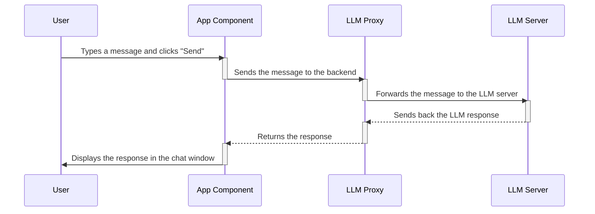

# Chapter 1: React Frontend Components

Welcome to the exciting world of building user interfaces! In this chapter, we'll explore **React Frontend Components**, the fundamental building blocks that make up the visual parts of our `Tutorial Chat Llama Nemotron` application.

Imagine building with LEGOs. Each LEGO brick is a component, and when you put them together, you create something amazing like a castle or a spaceship. Similarly, React components are like LEGO bricks for your web application. They're reusable pieces of code that define how a part of your website looks and behaves.

## Why Components?

Let's say you want to build a chat application where users can upload files and chat with an AI. Without components, you'd have one giant, messy file containing all the code for the upload button, the chat window, and everything else. This would be very hard to manage and update.

React components allow you to break down your application into smaller, manageable pieces. This makes your code:

*   **Easier to understand:** Each component has a specific purpose, making it easier to grasp what's going on.
*   **Reusable:** You can use the same component in different parts of your application, saving you time and effort.
*   **Maintainable:** If you need to change something, you only have to modify the relevant component, not the entire codebase.

## Key Components in Our App

In our `Tutorial Chat Llama Nemotron` application, we have two key React components that we'll be focusing on:

1.  **`FileIngestion`**: This component handles the crucial task of allowing users to upload files to be used by the RAG (Retrieval-Augmented Generation) system. Think of it as the "upload files" button and related logic.

2.  **`App`**: This is the main component that ties everything together. It manages the chat messages, the server IP input, various toggles (like enabling RAG), and the overall layout of the chat application. It's the "brains" of the frontend.

Let's explore each of these components in a bit more detail.

### 1. `FileIngestion` Component

The `FileIngestion` component is responsible for letting users upload files to the system. Here's a simplified view of the core functionality:

```javascript
// frontend/src/components/FileIngestion.js
function FileIngestion() {
  // ... (state variables for managing upload status, progress, etc.)

  const handleFileSelect = async (e) => {
    // This function is called when the user selects files
    const files = Array.from(e.target.files); // Get files from the input
    // Call function to upload the files (implementation skipped)
    await uploadFiles(files);
  };

  return (
    //... (JSX code for rendering the upload button and progress bar)
    <input
      type="file"
      id="fileInput"
      multiple
      onChange={handleFileSelect}
    />
    //...
  );
}
```

**Explanation:**

*   The `handleFileSelect` function is triggered when you select files from the file selection dialog.
*   `Array.from(e.target.files)` takes the selected files.
*   `uploadFiles` is responsible for uploading the files to the backend. (We won't dive into the backend part just yet, but know that the files are sent to the RAG service from [RAG Service](04_rag_service_.md) for indexing).
*   The `<input type="file"...>` element is what actually lets the user choose files. The `onChange` event handler is connected to `handleFileSelect` function.

Imagine you click the "Ingest Files" button. This opens a file selection dialog. After selecting your files, the `handleFileSelect` function is called, and the files are prepared for uploading. The `uploadFiles` function (not shown in detail here) then takes over to send the files to the backend.

### 2. `App` Component

The `App` component is the heart of our application. It manages the chat interface, user input, and the interaction with the backend. Here’s a simplified look:

```javascript
// frontend/src/App.js
function App() {
  const [messages, setMessages] = useState([]); // Store chat messages
  const [serverIp, setServerIp] = useState(''); // Store IP of the LLM server

  const handleSubmit = async (e) => {
    // This function is called when the user submits the chat form
    e.preventDefault(); // Prevent the page from refreshing
    const input = e.target.elements.messageInput; // Get message input
    const message = input.value.trim(); // Get the message
    if (!message) return; // Skip if message is empty

    // Add user message to the chat
    setMessages(prev => [...prev, { role: 'user', content: message }]);
    input.value = ''; // Clear the input

    // Send message to the backend (implementation skipped)
    // Receive the LLM response
    const assistantMessage = { role: 'assistant', content: "Hello from the LLM!" };

    // Add assistant message to the chat
    setMessages(prev => [...prev, assistantMessage]);
  };

  return (
    //... (JSX code for rendering the chat interface)
    <form onSubmit={handleSubmit}>
      <input type="text" name="messageInput" placeholder="What's on your mind?" />
      <button type="submit">Send</button>
    </form>
    //...
  );
}
```

**Explanation:**

*   `useState` is used to manage the state of the application. `messages` stores the chat messages, and `serverIp` stores the IP address of the LLM server.
*   The `handleSubmit` function is triggered when the user submits the chat form.
*   It prevents the page from refreshing (`e.preventDefault()`), retrieves the message from the input field, and adds it to the `messages` array.
*   Then it simulates a response from the LLM and display the response on the chat interface.
*   The `<form>` and `<input>` elements create the chat form where the user can type their messages.

Imagine you type "Hello" in the chat input and press "Send". The `handleSubmit` function is called, your message is added to the chat window, and a simulated response from the LLM is added as well.

## How Components Work Together

These components work together to create a seamless user experience. The `App` component renders the `FileIngestion` component, providing the user with the ability to upload files. The `App` component also handles the chat interface and communicates with the backend to send and receive messages.

## Under the Hood: Data Flow

Let's take a simplified example of how a message typed by a user makes its way through the application:



**Explanation:**

1.  **User:** Types a message in the chat input and clicks the "Send" button.
2.  **App Component:** The `handleSubmit` function in the `App` component is triggered. The message is added to the chat history.
3.  **LLM Proxy:** The `App` component sends the message to the LLM Proxy ([LLM Proxy](03_llm_proxy_.md)) (the backend) for processing.
4.  **LLM Server:** The LLM Proxy forwards the message to the LLM server.
5.  **LLM Server:** The LLM Server processes the message and sends back a response to the LLM Proxy.
6.  **LLM Proxy:** The LLM Proxy receives the response and sends it back to the `App` component.
7.  **App Component:** The `App` component receives the response and updates the chat history, displaying the LLM's response to the user.

## Conclusion

In this chapter, we've learned about React Frontend Components and how they're used to build the user interface of our `Tutorial Chat Llama Nemotron` application. We explored the `FileIngestion` and `App` components, understanding their roles and how they interact.

Now that we have a good understanding of React Frontend Components, let's move on to the next chapter, where we'll dive deeper into the [Frontend App Configuration](02_frontend_app_configuration_.md) and see how we can configure our application to suit our needs.


---

Generated by [AI Codebase Knowledge Builder](https://github.com/The-Pocket/Tutorial-Codebase-Knowledge)