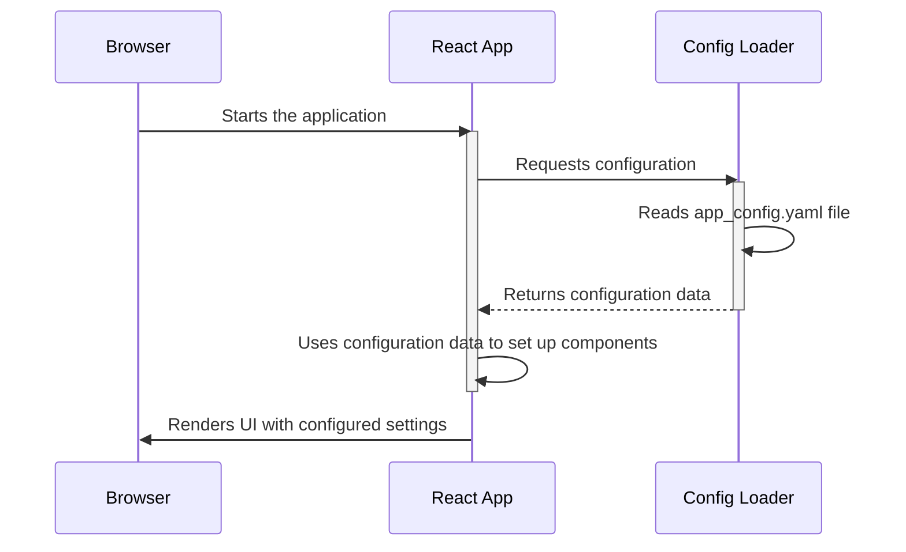

# Chapter 2: Frontend App Configuration

In the previous chapter, [React Frontend Components](01_react_frontend_components_.md), we learned about the building blocks of our user interface: components like `FileIngestion` and `App`. Now, let's talk about how we can *customize* how our application behaves without changing the code itself! This is where the Frontend App Configuration comes in.

Imagine you want to change the maximum file size users can upload to our `Tutorial Chat Llama Nemotron` application. Instead of digging into the code and changing the `FileIngestion` component, wouldn't it be easier to just change a setting somewhere? That's exactly what the Frontend App Configuration allows us to do!

The Frontend App Configuration is like a control panel for our frontend. It defines various settings that control how our application looks and behaves. It's all stored in a YAML file, making it easy to read and modify.

## What is Frontend App Configuration?

Think of it as a recipe for our application. The recipe (configuration) tells the application how to behave (e.g., which server to connect to, how big files can be, etc.).  The most important concept is: we can change the recipe without rewriting the entire application (code)!

Here are the key concepts related to the frontend app configuration:

*   **Configuration File:**  This is a `*.yaml` file that stores all the settings. YAML (YAML Ain't Markup Language) is a human-readable data serialization format.  Think of it like a neatly organized text file.

*   **Settings:** These are the individual options that control the application's behavior.  Examples include the API endpoint, the maximum file size, the chat interface prompt, etc.

*   **Dynamic Configuration:**  The application loads these settings when it starts up. This means you can change the settings and restart the application to see the changes, without needing to rewrite any code.

## Why Do We Need a Configuration?

Having a configuration file offers several benefits:

*   **Flexibility:** Easily change settings without modifying code.
*   **Maintainability:** Settings are centralized in one place, making them easier to manage.
*   **Environment-Specific Settings:** You can have different configuration files for different environments (e.g., development, testing, production).

## Our Configuration File: `app_config.yaml`

In our `Tutorial Chat Llama Nemotron` project, we have a YAML file named `app_config.yaml` that contains all the frontend configuration settings. You can find it in the `frontend/public/config/` directory and `/frontend/src/config/` directory. Let's take a look at some key parts of this file:

```yaml
# API Configuration
api:
  ip: "localhost"
  port: "8001"
  base_url: "http://localhost:8001"
  endpoints:
    upload: "/api/upload"
    search: "/api/search"
```

**Explanation:**

*   This section defines the settings for our API (Application Programming Interface), which is how our frontend communicates with the backend.
*   `ip` and `port` specify the IP address and port number of the backend server.
*   `base_url` combines the IP and port to form the base URL.
*   `endpoints` defines the specific URLs for different actions like uploading files (`/api/upload`) and searching (`/api/search`).

```yaml
# UI Configuration
ui:
  components:
    file_upload:
      max_file_size: 10485760  # 10MB in bytes
      accepted_file_types:
        - "application/pdf"
        - "text/plain"
```

**Explanation:**

*   This section configures the user interface (UI) components.
*   `file_upload` configures the file upload component.
*   `max_file_size` sets the maximum file size allowed for uploads (10MB in this case).
*   `accepted_file_types` defines the file types that the user can upload (PDF, plain text).

## How to Use the Configuration

Let's say we want to change the maximum file size that users can upload from 10MB to 5MB. Here's how we would do it:

1.  **Open the `app_config.yaml` file.**  You can find it in `frontend/public/config/app_config.yaml` and `frontend/src/config/app_config.yaml`.
2.  **Locate the `max_file_size` setting** under the `ui.components.file_upload` section.
3.  **Change the value from `10485760` to `5242880`** (5MB in bytes).

```yaml
ui:
  components:
    file_upload:
      max_file_size: 5242880  # 5MB in bytes
```

4.  **Save the file.**
5.  **Restart the frontend application.**

Now, when users try to upload a file larger than 5MB, the application will prevent the upload and display an error message (the error message content is also defined in this same file!). This demonstrates how we can easily change the behavior of our application without modifying any code.

## Under the Hood: How the Configuration is Loaded

Let's take a look at how the frontend loads the configuration file and uses the settings.

Here's a simplified overview of the process:



**Explanation:**

1.  **Browser:** The user opens the application in their web browser.
2.  **React App:** The React application starts running.
3.  **Config Loader:** The React application uses the [Configuration Loader](07_configuration_loader_.md) to read the `app_config.yaml` file.
4.  **Config Loader:** The Configuration Loader reads the YAML file and parses its contents into a JavaScript object.
5.  **React App:** The React application receives the configuration data and uses it to configure its components. For example, it sets the `max_file_size` for the `FileIngestion` component based on the value in the configuration.
6.  **Browser:** The React application renders the UI, using the configured settings.

While the detailed implementation of Configuration Loader will be discussed in [Configuration Loader](07_configuration_loader_.md), let's see the simplified example of how to read configuration from file.

```javascript
//frontend/src/config/config.js (Simplified)
import config from './app_config.yaml';

function getConfig() {
  return config;
}

export default getConfig;
```

**Explanation:**

*   This JavaScript file imports the `app_config.yaml` file as a JavaScript object.  Many modern bundlers like Webpack or Parcel automatically handle this conversion.
*   The `getConfig` function returns the configuration object.

```javascript
//frontend/src/components/FileIngestion.js (Simplified)
import getConfig from '../config/config';

function FileIngestion() {
  const config = getConfig();
  const maxFileSize = config.ui.components.file_upload.max_file_size;

  //... (rest of the component logic)

  return (
    //...
  );
}
```

**Explanation:**

*   The `FileIngestion` component imports the `getConfig` function.
*   It calls `getConfig()` to get the configuration object.
*   It then accesses the `max_file_size` setting from the configuration object and uses it to configure the component.

## Conclusion

In this chapter, we've learned about the Frontend App Configuration and how it allows us to customize the behavior of our application without modifying code. We explored the `app_config.yaml` file, saw how to change settings like the maximum file size, and learned how the configuration is loaded and used by the frontend.

Now that we understand how to configure the frontend, let's move on to the next chapter, where we'll dive into the [LLM Proxy](03_llm_proxy_.md) and see how it helps us communicate with the Language Model.


---

Generated by [AI Codebase Knowledge Builder](https://github.com/The-Pocket/Tutorial-Codebase-Knowledge)