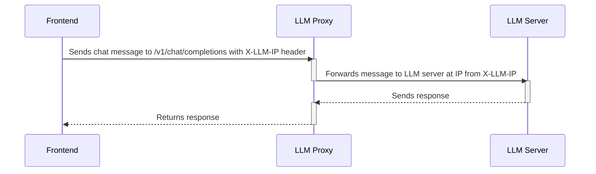

# Chapter 3: LLM Proxy

In the previous chapter, [Frontend App Configuration](02_frontend_app_configuration_.md), we learned how to customize the frontend of our `Tutorial Chat Llama Nemotron` application using a configuration file.  Now, let's talk about something that acts like a middleman, ensuring smooth communication between your frontend and the actual AI brain, the LLM. This is where the **LLM Proxy** comes in.

Imagine you're ordering food online. You don't directly talk to the kitchen; you talk to a waiter who takes your order, delivers it to the kitchen, gets the food, and brings it back to you. The LLM Proxy is like that waiter!

## Why Do We Need a Proxy?

Let's say you want to chat with our AI. Your browser (where the frontend runs) needs to send messages to the LLM (Language Model) server. But sometimes, browsers have security restrictions that prevent them from directly talking to servers on different "domains" (different website addresses). This is called **CORS (Cross-Origin Resource Sharing)**.

The LLM Proxy solves this problem! It sits between your frontend and the LLM server, acting as an intermediary. It handles the CORS issues and forwards your requests to the LLM, then sends the LLM's response back to your frontend. Think of it as a translator making sure everyone understands each other.

Here's a breakdown of the key benefits:

*   **CORS Handling:**  The proxy takes care of the browser's security restrictions, allowing your frontend to communicate with the LLM server even if they're on different domains.
*   **Centralized Communication:** All requests to the LLM go through the proxy, making it easier to manage and monitor the communication.
*   **IP Configuration via Frontend:** The frontend can tell the proxy which LLM server to use (more on this later!).
*   **Request Timeout Management:**  The proxy can be configured to automatically stop waiting for a response from the LLM after a certain time, preventing your application from getting stuck.
*   **Request Logging:** The proxy can log all requests and responses, which is helpful for debugging and monitoring performance.

## Key Concepts:

Let's break down some of the important ideas behind the LLM Proxy:

1.  **Proxy:** A server that acts as an intermediary between a client (your frontend) and another server (the LLM server).
2.  **CORS (Cross-Origin Resource Sharing):** A browser security feature that restricts web pages from making requests to a different domain than the one which served the web page. The proxy circumvents the restriction by making requests to the LLM server on the same domain.
3.  **Headers:** Information sent along with HTTP requests and responses. The proxy uses headers like `X-LLM-IP` to get information from the frontend.
4.  **Endpoints:** Specific URLs on a server that handle different types of requests.  For example, `/v1/chat/completions` is an endpoint for sending chat messages to the LLM.

## Using the LLM Proxy

Okay, so how do we actually use this proxy thing?  Let's say a user types "Hello, AI!" into the chat application. Here's a simplified version of what happens.

1.  The frontend sends a message to the proxy, including the message text and the IP address of the LLM server.
2.  The proxy receives the message and forwards it to the LLM server at the specified IP address.
3.  The LLM server processes the message and sends a response back to the proxy.
4.  The proxy receives the response and sends it back to the frontend.
5.  The frontend displays the response to the user.

Here's a simplified code snippet of what the frontend might do:

```javascript
// Simplified example from frontend
async function sendMessage(message, llmIp) {
  const response = await fetch('/v1/chat/completions', { // Proxy endpoint
    method: 'POST',
    headers: {
      'Content-Type': 'application/json',
      'X-LLM-IP': llmIp // IP of the LLM server
    },
    body: JSON.stringify({ message: message })
  });
  const data = await response.json();
  return data;
}
```

**Explanation:**

*   This `sendMessage` function sends a POST request to the `/v1/chat/completions` endpoint on the proxy server.
*   The `X-LLM-IP` header tells the proxy where the LLM server is located.  This is how we configure the server IP address via the frontend.
*   The `body` contains the message we want to send to the LLM.

The proxy then receives this request, forwards it to the actual LLM server, and sends back the LLM response to our frontend!

## Under the Hood: How It Works

Let's take a peek under the hood to see how the LLM Proxy actually works.

Here's a step-by-step walkthrough:



**Explanation:**

1.  **Frontend:** The frontend sends a chat message to the `/v1/chat/completions` endpoint on the LLM Proxy, including the LLM server's IP address in the `X-LLM-IP` header.
2.  **LLM Proxy:** The LLM Proxy receives the request. It reads the LLM server's IP address from the `X-LLM-IP` header.
3.  **LLM Proxy:** The LLM Proxy forwards the message to the LLM server at the specified IP address.
4.  **LLM Server:** The LLM server processes the message and sends a response back to the LLM Proxy.
5.  **LLM Proxy:** The LLM Proxy receives the response from the LLM server.
6.  **LLM Proxy:** The LLM Proxy sends the response back to the frontend.

Now, let's look at some actual code from the `proxy.py` file (located in `backend-dynamo/llm-proxy/`). Don't worry if you don't understand all of it; the comments will help!

```python
# backend-dynamo/llm-proxy/proxy.py
from fastapi import FastAPI, HTTPException, Header
from typing import List, Dict, Optional
import httpx

app = FastAPI()

# Initialize HTTP client
http_client = httpx.AsyncClient()

@app.post("/v1/chat/completions")
async def proxy_chat_completions(request: ChatCompletionRequest, x_llm_ip: str = Header(None)):
    """Forward chat completion requests to NVIDIA Dynamo server"""
    if not x_llm_ip:
        raise HTTPException(status_code=400, detail="X-LLM-IP header is required")
    try:
        # Forward request to NVIDIA Dynamo server
        response = await http_client.post(
            f"http://{x_llm_ip}:{config['llm']['port']}/v1/chat/completions",
            json=request.dict(),
        )
        return response.json()
    except Exception as e:
        raise HTTPException(status_code=500, detail=str(e))
```

**Explanation:**

*   `@app.post("/v1/chat/completions")`: This tells FastAPI (a web framework for Python) that this function should be called when a POST request is sent to the `/v1/chat/completions` endpoint.
*   `x_llm_ip: str = Header(None)`: This gets the value of the `X-LLM-IP` header from the request.
*   `f"http://{x_llm_ip}:{config['llm']['port']}/v1/chat/completions"`: This constructs the URL of the LLM server, using the IP address from the header and the port from the configuration file.  The port number is read from the `config.yaml` which we briefly mentioned. We are reading the file using the [Configuration Loader](07_configuration_loader_.md).
*   `response = await http_client.post(...)`: This sends the request to the LLM server.
*   `return response.json()`: This sends the response from the LLM server back to the frontend.

This code snippet shows how the LLM Proxy receives the request, extracts the LLM server's IP address, forwards the request to the LLM server, and sends the response back to the frontend.

## Configuration

The `config.yaml` file (located in `backend-dynamo/llm-proxy/`) lets you configure the proxy, including the port it listens on, the CORS settings, and the LLM server's default port.

```yaml
# backend-dynamo/llm-proxy/config.yaml
llm:
  port: "8000"

proxy:
  port: "8002"
  cors:
    allow_origins: ["http://localhost:3000"]
    allow_credentials: true
    allow_methods: ["*"]
    allow_headers: ["*", "X-LLM-IP"]
```

## Conclusion

In this chapter, we've learned about the LLM Proxy, why it's needed, and how it works. We saw how it handles CORS, forwards requests to the LLM server, and sends responses back to the frontend. We also looked at some code snippets to understand the internal implementation.

Now that we have an LLM Proxy to handle communication with the LLM, let's move on to the next chapter, where we'll explore the [RAG Service](04_rag_service_.md) and see how it helps us augment the LLM with external knowledge.


---

Generated by [AI Codebase Knowledge Builder](https://github.com/The-Pocket/Tutorial-Codebase-Knowledge)