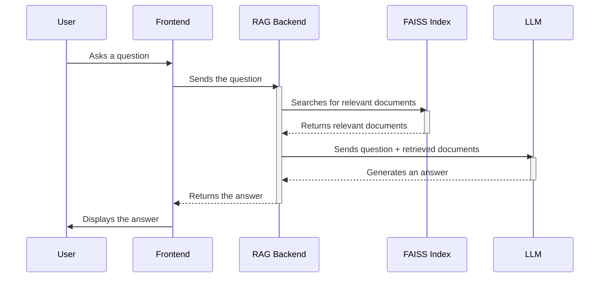

# Chapter 4: RAG Service

In the previous chapter, [LLM Proxy](03_llm_proxy_.md), we learned how to create a middleman that enables the frontend to communicate with the LLM (Language Model). Now, let's dive into how we can make our AI smarter by giving it access to information beyond what it already knows! This is where the **RAG Service** comes in.

Imagine you're talking to a chatbot and ask, "What are the latest research findings on llama herding in Patagonia?". If the chatbot only relies on its pre-trained knowledge, it might not know the answer or provide outdated information. However, if we can provide the chatbot with a library of recent research papers, it can then search through them and give you a much more informed answer. That's exactly what the RAG Service does!

The RAG (Retrieval-Augmented Generation) Service is like a librarian for our LLM. It helps the LLM find relevant information from a knowledge base (like a collection of documents) to provide better answers.

## Key Concepts

Let's break down the RAG Service into smaller, more digestible pieces:

1.  **Knowledge Base:** This is where we store all the information that the LLM can use. It can be a collection of documents, articles, websites, or any other data source. Think of it as the LLM's personal library.

2.  **Indexing:** Before the LLM can search the knowledge base, we need to organize it. Indexing is the process of creating a searchable index of the documents in the knowledge base. It's like creating a card catalog for a library, making it easier to find books.

3.  **Retrieval:** When the user asks a question, the RAG Service needs to find the most relevant documents in the knowledge base. Retrieval is the process of searching the index and finding the documents that are most similar to the user's query. This is like a librarian searching for the books that are most related to your question.

4.  **Augmentation:** After retrieving the relevant documents, the RAG Service combines them with the user's query and sends the combined information to the LLM. This is like the librarian giving you the relevant books so you can write a well-informed answer.

5.  **Generation:** Finally, the LLM uses the augmented information to generate a response to the user's query. It uses the retrieved documents to provide a more accurate and comprehensive answer.

## How It Works: An Analogy

Let's use an analogy to understand how the RAG Service works. Imagine you're a student working on a research paper about the history of pizza.

1.  **Knowledge Base:** You have a collection of books, articles, and websites about pizza history (your knowledge base).
2.  **Indexing:** You create a card catalog (index) that lists all the resources in your collection and their main topics.
3.  **Retrieval:** When your professor asks you a question about the origin of pepperoni pizza (your query), you use the card catalog to find the resources that are most relevant to your question.
4.  **Augmentation:** You gather the relevant resources and combine them with your original question.
5.  **Generation:** You read the resources and use the information to write a well-informed answer to your professor's question.

## Using the RAG Service

Let's look at a simple example of how to use the RAG Service to answer a question about llama herding.

First, we need to add some documents to the knowledge base. Imagine we have a document that contains the following text:

```
Llama herding is a traditional practice in the Andes Mountains. It involves raising llamas for their wool, meat, and as pack animals.
```

Then we can ask a query. For example:

```
What is llama herding?
```

The RAG service does the following:

1.  **Retrieval:** The RAG Service searches the index and finds the document about llama herding.
2.  **Augmentation:** The RAG Service combines the user's query with the relevant document: "What is llama herding? Llama herding is a traditional practice in the Andes Mountains. It involves raising llamas for their wool, meat, and as pack animals."
3.  **Generation:** The combined information is sent to the LLM, and the LLM generates a response: "Llama herding is a traditional practice in the Andes Mountains where llamas are raised for their wool, meat, and as pack animals."

## Under the Hood

Let's take a peek under the hood to see how the RAG Service works internally.

Here's a step-by-step walkthrough of the process:



**Explanation:**

1.  **User:** The user asks a question through the frontend.
2.  **Frontend:** The frontend sends the question to the RAG Backend.
3.  **RAG Backend:** The RAG Backend receives the question and searches the FAISS index for relevant documents.
4.  **FAISS Index:** The FAISS index returns the most relevant documents to the RAG Backend. FAISS is a library for efficient similarity search.
5.  **RAG Backend:** The RAG Backend combines the user's question with the retrieved documents and sends the combined information to the LLM.
6.  **LLM:** The LLM uses the augmented information to generate an answer.
7.  **RAG Backend:** The RAG Backend sends the answer back to the frontend.
8.  **Frontend:** The frontend displays the answer to the user.

Let's look at some actual code from the `rag_service.py` file (located in `backend-rag/src/`). Don't worry if you don't understand all of it; the comments will help!

```python
# backend-rag/src/rag_service.py
from sentence_transformers import SentenceTransformer
import faiss

class RAGService:
    def __init__(self):
        # Load the Sentence Transformer model
        self.model = SentenceTransformer('all-MiniLM-L6-v2')
        # Create a FAISS index
        self.index = faiss.IndexFlatL2(384) #384 is embedding dimension

    def search(self, query: str, k: int = 5):
        # Generate the embedding for the query
        query_embedding = self.model.encode(query)
        # Search the FAISS index
        distances, indices = self.index.search(query_embedding.reshape(1, -1), k)
        # Return the results
        return indices
```

**Explanation:**

*   `self.model = SentenceTransformer('all-MiniLM-L6-v2')`:  This line loads a pre-trained Sentence Transformer model. Sentence Transformers are used to generate embeddings (numerical representations) of text. These embeddings capture the semantic meaning of the text, allowing us to compare different pieces of text based on their meaning.
*   `self.index = faiss.IndexFlatL2(384)`: This line creates a FAISS index. FAISS (Facebook AI Similarity Search) is a library for efficient similarity search.  `IndexFlatL2` creates an index that uses the L2 distance (Euclidean distance) to measure similarity between vectors. `384` represents the dimension of the vector, which matches with the embedding dimensions of `all-MiniLM-L6-v2`
*   `query_embedding = self.model.encode(query)`: This encodes the search query into a vector (embedding).
*   `distances, indices = self.index.search(query_embedding.reshape(1, -1), k)`: This searches the index for the `k` most similar vectors to the query vector.
*   `return indices`: This returns the indices of the k most similar document.

## Configuration

The behavior of the RAG Service can be customized via the `rag_config.yaml` file (located in `backend-rag/src/config/`). This file lets you configure various parameters, such as the chunk size for splitting documents, the embedding model to use, and the number of results to return from the search.

```yaml
# backend-rag/src/config/rag_config.yaml
model:
  name: "all-MiniLM-L6-v2"
  dimension: 384

text_processing:
  chunk_size: 512
  chunk_overlap: 128

search:
  default_k: 5
```

## Conclusion

In this chapter, we've learned about the RAG Service and how it helps us make our AI smarter by giving it access to external knowledge. We explored the key concepts of indexing, retrieval, augmentation, and generation, and we saw how the RAG Service works internally.

Now that we have a RAG Service to augment the LLM with external knowledge, let's move on to the next chapter, where we'll build the [RAG Backend Application (FastAPI)](05_rag_backend_application__fastapi__.md) to tie it all together!


---

Generated by [AI Codebase Knowledge Builder](https://github.com/The-Pocket/Tutorial-Codebase-Knowledge)