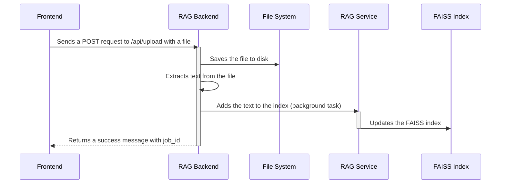

# Chapter 5: RAG Backend Application (FastAPI)

In the previous chapter, [RAG Service](04_rag_service_.md), we learned how to give our AI access to external knowledge, making it smarter! Now, let's learn how to build a "control panel" that allows us to manage our RAG service and let our frontend interact with it. This is where the **RAG Backend Application (FastAPI)** comes in.

Imagine you want to upload new documents to the RAG service so the AI can learn from them. Or perhaps you want to clear the entire knowledge base and start fresh. You need a way to do these things without directly interacting with the RAG service's code. The RAG Backend Application provides a user-friendly interface for managing these tasks through API endpoints.

## What is the RAG Backend Application?

The RAG Backend Application, built using FastAPI (a Python web framework), acts as an intermediary between the frontend (our chat interface) and the [RAG Service](04_rag_service_.md). It's like a waiter in a restaurant, taking orders (requests) from customers (frontend) and delivering them to the kitchen (RAG service) and bringing the results back.

Here's what it does:

*   **Manages the RAG service:** It provides API endpoints for uploading documents, clearing the index, and searching for relevant information.
*   **Handles document uploads:** It receives documents from the frontend, saves them, and adds them to the RAG service's knowledge base.
*   **Provides search functionality:** It receives search queries from the frontend, sends them to the RAG service, and returns the results.
*   **Acts as a control panel:** It allows us to monitor the status of the RAG service (e.g., how many documents are indexed) and perform maintenance tasks (e.g., clearing the index).
*   **Persistent Storage:** It manages the storage for documents and indices to survive server restarts.

## Key Concepts

Let's break down the RAG Backend Application into smaller pieces:

1.  **API Endpoints:** These are specific URLs that the frontend can use to interact with the backend. For example, `/api/upload` might be an endpoint for uploading documents, and `/api/search` might be an endpoint for searching.

2.  **FastAPI:** A Python framework for building APIs. It makes it easy to define API endpoints, handle requests, and return responses.

3.  **Requests and Responses:** The frontend sends requests to the backend, and the backend sends responses back to the frontend. These requests and responses are typically in JSON format.

4.  **Background Tasks:**  Operations like indexing a document can take time.  Background tasks allow the API to respond quickly while the indexing happens in the background.

## Using the RAG Backend Application

Let's imagine we want to upload a PDF document to the RAG service. Here's how we would do it:

1.  **The frontend sends a POST request to the `/api/upload` endpoint**, including the PDF document as part of the request.
2.  **The backend receives the request**, saves the PDF document to a designated folder (configured in `app_config.yaml`), extracts the text from the document, and adds the text to the RAG service's index.
3.  **The backend sends a response back to the frontend**, indicating whether the upload was successful. The response contains a `job_id` for checking on the progress of the upload.

Here's a simplified example of what the request might look like from the frontend:

```javascript
// Simplified example from frontend
async function uploadFile(file) {
  const formData = new FormData();
  formData.append('files', file); // 'files' is the key the backend expects

  const response = await fetch('/api/upload', {
    method: 'POST',
    body: formData,
  });
  const data = await response.json();
  return data; // Contains job_id
}
```

**Explanation:**

*   This JavaScript code creates a `FormData` object and appends the file to it.
*   It then sends a POST request to the `/api/upload` endpoint, including the `FormData` object as the body of the request.
*   The backend processes the request and returns a JSON response.

Let's say the file uploaded successfully. The backend might return a JSON response like this:

```json
{
  "job_id": "a1b2c3d4-e5f6-7890-1234-567890abcdef",
  "saved_files": ["example.pdf"],
  "message": "Successfully saved 1 files and started processing"
}
```

The frontend then uses the `job_id` to check the status of the upload by calling `/api/upload/progress/{job_id}`.

## Under the Hood

Let's take a peek under the hood to see how the RAG Backend Application works internally.

Here's a step-by-step walkthrough of the upload process:



**Explanation:**

1.  **Frontend:** The frontend sends a POST request to the `/api/upload` endpoint, including a file.
2.  **RAG Backend:** The RAG Backend receives the request, saves the file to the file system (configured via `app_config.yaml`), and extracts the text from the file.
3.  **RAG Backend:** The RAG Backend adds the extracted text to the RAG Service's index as a background task (so the API doesn't have to wait).
4.  **RAG Service:** The RAG Service updates the FAISS index with the new text.
5.  **RAG Backend:** The RAG Backend sends a success message back to the frontend, including a `job_id`.

Now, let's look at some actual code from the `app.py` file (located in `backend-rag/src/`).

```python
# backend-rag/src/app.py
from fastapi import FastAPI, UploadFile, File
from typing import List

app = FastAPI()

@app.post("/api/upload")
async def upload_files(files: List[UploadFile] = File(...)):
    # 1. Save the uploaded files
    # 2. Extract text from the files
    # 3. Add the extracted text to the RAG service's index
    # 4. Return a success message
    return {"message": f"Successfully uploaded {len(files)} files"}
```

**Explanation:**

*   `@app.post("/api/upload")`: This tells FastAPI that this function should be called when a POST request is sent to the `/api/upload` endpoint.
*   `async def upload_files(files: List[UploadFile] = File(...))`: This defines the function that will handle the upload request. It takes a list of `UploadFile` objects as input, which represent the files that were uploaded.
*   The rest of the function (currently represented by comments) will handle saving the files, extracting text, adding the text to the RAG service, and returning a success message.

Let's look at another snippet from `app.py` for retrieving documents:

```python
from fastapi.responses import FileResponse
import os

@app.get("/api/document/{file_id}")
async def get_document(file_id: str):
    """Serve a stored document for viewing in browser"""
    file_path = os.path.join("storage/documents", file_id) # Location configured in app_config.yaml
    return FileResponse(file_path, filename=file_id)
```

**Explanation:**

*   `@app.get("/api/document/{file_id}")`:  This defines the endpoint for retrieving a specific document. The `file_id` is passed as a parameter in the URL.
*   `file_path = os.path.join("storage/documents", file_id)`: This constructs the full path to the requested file. Note that `storage/documents` is configured in the `app_config.yaml` as `documents_dir`.
*   `return FileResponse(file_path, filename=file_id)`: This returns the file as a response.  The browser will attempt to display it if possible, or download it.

## Configuration

The RAG Backend Application's behavior is primarily configured using two YAML files: `app_config.yaml` and `rag_config.yaml`. These files are located in the `backend-rag/src/config/` directory. We briefly mentioned these files in [RAG Service](04_rag_service_.md). We are using [Configuration Loader](07_configuration_loader_.md) to load these files.

*   `app_config.yaml`: This file contains application-specific settings, such as the port number, CORS settings, and storage directories.

```yaml
# backend-rag/src/config/app_config.yaml
storage:
  documents_dir: "storage/documents"
  index_dir: "index"
```

*   `rag_config.yaml`: This file configures the [RAG Service](04_rag_service_.md) itself, like the embedding model, chunk sizes and search parameters.

## Conclusion

In this chapter, we've learned about the RAG Backend Application (FastAPI) and how it acts as a control panel for our RAG service. We saw how it manages document uploads, provides search functionality, and allows us to monitor the status of the RAG service.

Now that we have a RAG Backend Application, let's move on to the next chapter, where we'll explore the [NVIDIA Dynamo Backend](06_nvidia_dynamo_backend_.md) and see how it can further enhance our application.


---

Generated by [AI Codebase Knowledge Builder](https://github.com/The-Pocket/Tutorial-Codebase-Knowledge)