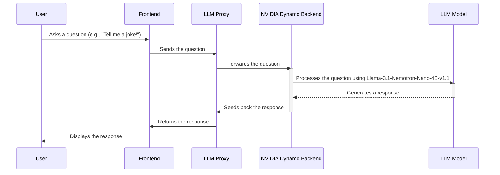

# Chapter 6: NVIDIA Dynamo Backend

In the previous chapter, [RAG Backend Application (FastAPI)](05_rag_backend_application__fastapi__.md), we learned how to build a control panel for our RAG service! Now, let's get to the heart of our application: the AI brain itself! This is where the **NVIDIA Dynamo Backend** comes in.

Imagine you're using a chat application to ask questions. The frontend is the interface you see, the RAG service provides extra knowledge, but *something* needs to understand your questions and generate responses. That "something" is the LLM (Large Language Model), and in our case, it's powered by NVIDIA Dynamo.

## What is the NVIDIA Dynamo Backend?

Think of the NVIDIA Dynamo Backend as the powerful engine that drives our entire application. It's the core LLM server, like the brain of the application. It runs the `Llama-3.1-Nemotron-Nano-4B-v1.1` model and generates responses based on the user's input. Think of it as a powerful computer that can understand and respond to your questions. It takes in text, processes it through the LLM, and returns a generated text completion. It leverages NVIDIA GPUs for accelerated inference. This means it can generate responses *really* fast!

In short: It's the AI that does the talking!

## Key Concepts

Let's break down the key concepts behind the NVIDIA Dynamo Backend:

1.  **LLM (Large Language Model):**  This is the AI model itself. In our case, it's `Llama-3.1-Nemotron-Nano-4B-v1.1`. Think of it as a vast collection of knowledge and a sophisticated algorithm for understanding and generating text. It has been trained on a massive dataset of text and code, enabling it to perform a wide range of tasks, including answering questions, generating creative content, and translating languages.

2.  **NVIDIA Dynamo:** This is the software framework that *runs* the LLM efficiently, allowing it to respond quickly. It's like the engine that powers a car.  Dynamo is designed for high-throughput and low-latency inference, making it ideal for serving generative AI models like Llama-3.  It optimizes the LLM for NVIDIA GPUs.

3.  **GPU (Graphics Processing Unit):** This is the specialized hardware that makes the LLM run fast. GPUs are designed for parallel processing, which is essential for the complex calculations involved in running LLMs.

4.  **Inference:** The process of using a trained LLM to generate predictions or responses.  In our case, inference is the process of taking user input and generating a relevant and coherent response.

## Using the NVIDIA Dynamo Backend

So, how does this all work together? Let's say you ask our chat application: "Tell me a joke!". Here's what happens:

1.  Your message ("Tell me a joke!") is sent from the frontend, through the [LLM Proxy](03_llm_proxy_.md), to the NVIDIA Dynamo Backend.
2.  The NVIDIA Dynamo Backend receives your message and feeds it to the `Llama-3.1-Nemotron-Nano-4B-v1.1` model.
3.  The `Llama-3.1-Nemotron-Nano-4B-v1.1` model processes the message and generates a response (e.g., "Why don't scientists trust atoms? Because they make up everything!").
4.  The response is sent back through the [LLM Proxy](03_llm_proxy_.md) to the frontend, and you see the joke in your chat window.

The core part is what's happening in the Dynamo Backend:

```bash
# Example Interaction (Simplified)
User Query: Tell me a joke!
LLM Input: Tell me a joke!
LLM Output: Why don't scientists trust atoms? Because they make up everything!
```

The LLM takes your question as input, and gives you an answer as output.

## Under the Hood: How it Works

Let's peek under the hood to see how the NVIDIA Dynamo Backend works.

Here's a simplified view of the process:



**Explanation:**

1.  **User:** The user asks a question through the frontend.
2.  **Frontend:** The frontend sends the question to the [LLM Proxy](03_llm_proxy_.md).
3.  **LLM Proxy:** The [LLM Proxy](03_llm_proxy_.md) forwards the question to the NVIDIA Dynamo Backend.
4.  **NVIDIA Dynamo Backend:** The NVIDIA Dynamo Backend receives the question and processes it using the `Llama-3.1-Nemotron-Nano-4B-v1.1` model.
5.  **LLM Model:** The `Llama-3.1-Nemotron-Nano-4B-v1.1` model generates a response.
6.  **NVIDIA Dynamo Backend:** The NVIDIA Dynamo Backend sends the response back to the [LLM Proxy](03_llm_proxy_.md).
7.  **LLM Proxy:** The [LLM Proxy](03_llm_proxy_.md) returns the response to the frontend.
8.  **Frontend:** The frontend displays the response to the user.

Now let's look at how the NVIDIA Dynamo Backend is run, referring to the `backend-dynamo/README.md` file.

First, we need to start the dependency services:

```bash
docker compose -f deploy/metrics/docker-compose.yml up -d
```

Then, we execute the container with the LLM:
```bash
# Allow port so that remote client can discover it. Dynamo will be using port 8000
sudo ufw allow 8000

# Execute the container
./container/run.sh --gpus all -it --framework vllm -v "$(pwd)/../config:/workspace/examples/llm/configs"
```

Finally, let's start our server:
```bash
# Navigate to the directory with example scripts
cd examples/llm

# Start the service
dynamo serve graphs.agg:Frontend -f configs/agg_llama_nemotron_4b.yaml
```

The `dynamo serve` command starts the NVIDIA Dynamo Backend, loading the `Llama-3.1-Nemotron-Nano-4B-v1.1` model and making it ready to receive requests. The configurations are in `agg_llama_nemotron_4b.yaml`.

## Configuration

The behavior of the NVIDIA Dynamo Backend is configured primarily via YAML files.

The model is configured in `backend-dynamo/config/agg_llama_nemotron_4b.yaml`. Here are some key parameters:

```yaml
Common:
  model: nvidia/Llama-3.1-Nemotron-Nano-4B-v1.1 # This line specifies the model to use
  max-model-len: 131072 # This line specifies the maximum context length for the model

Frontend:
  port: 8000 # This line specifies the port number that the LLM server listens on
```

## Conclusion

In this chapter, we've learned about the NVIDIA Dynamo Backend, the powerful engine that drives our chat application. We explored the key concepts, saw how it processes user requests, and peeked under the hood to understand its internal workings.

Now that we have a working NVIDIA Dynamo Backend, let's move on to the next chapter, where we'll explore the [Configuration Loader](07_configuration_loader_.md) and see how it helps us manage the configuration of our entire application.


---

Generated by [AI Codebase Knowledge Builder](https://github.com/The-Pocket/Tutorial-Codebase-Knowledge)