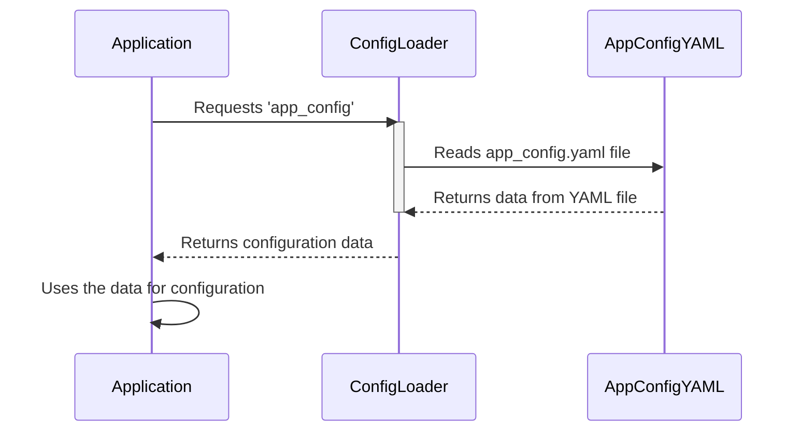

# Chapter 7: Configuration Loader

In the previous chapter, [NVIDIA Dynamo Backend](06_nvidia_dynamo_backend_.md), we learned about the powerful AI engine that powers our chat application. But how do we tell all these different parts – the frontend, the backend, the RAG service, the LLM – how to behave? How do we set the rules without changing the code every time? This is where the **Configuration Loader** comes to the rescue!

Imagine you're building a house. You wouldn't want to hardcode the color of the walls or the size of the windows directly into the structure. Instead, you'd use a blueprint that specifies these details. The Configuration Loader is like a blueprint for our application, telling each part how to behave without requiring us to rebuild the entire thing every time we want to make a change.

**Why do we need a Configuration Loader?**

Let's say we want to change the port number that the RAG backend listens on. Without a Configuration Loader, we'd have to find the line of code that sets the port number, change it, and then re-deploy the entire backend. This is time-consuming and error-prone. With a Configuration Loader, we can simply change a value in a configuration file and restart the application. Much easier!

The Configuration Loader solves these problems:

*   **Centralized settings:** Keeps all the configuration settings in one place (YAML files), making them easy to find and manage.
*   **Flexibility:** Allows us to change settings without modifying the code.
*   **Modularity:** Decouples configuration from code, making the application more modular and maintainable.

## Key Concepts

The Configuration Loader has a few key parts:

1.  **Configuration Files (YAML):** These are the files that store the settings. We use YAML files because they're easy to read and write. Think of them as nicely organized text files.
2.  **Loading:** The Configuration Loader reads these YAML files and loads the settings into the application.
3.  **Accessing:** The application can then access these settings and use them to configure its behavior.

## Using the Configuration Loader

Let's say we want to get the port number that the RAG backend listens on. Here's how we would do it using the Configuration Loader:

```python
# backend-rag/src/app.py
from backend_rag.src.config.config_loader import config_loader

config = config_loader.get_app_config()
port = config['app']['port']
print(f"The RAG backend is listening on port {port}")
```

**Explanation:**

*   `from backend_rag.src.config.config_loader import config_loader`: This line imports the `config_loader` instance from our configuration loader module. It's like grabbing the blueprint for our house.
*   `config = config_loader.get_app_config()`: This line loads the application configuration from the `app_config.yaml` file. Now we have access to all the settings defined in that file.
*   `port = config['app']['port']`: This line retrieves the port number from the configuration. We're looking at the blueprint and finding the section that specifies the port number.
*   `print(f"The RAG backend is listening on port {port}")`: This line prints the port number to the console.

So, if `app_config.yaml` contains:

```yaml
app:
  port: 8001
```

The output of the code would be:

```
The RAG backend is listening on port 8001
```

## Under the Hood: How It Works

Let's take a peek under the hood to see how the Configuration Loader works.

Here's a step-by-step walkthrough:



**Explanation:**

1.  **Application:** The application needs a configuration setting (e.g., the port number).
2.  **ConfigLoader:** The application asks the Configuration Loader for the `app_config`.
3.  **ConfigLoader:** The Configuration Loader reads the `app_config.yaml` file.
4.  **AppConfigYAML:** The `app_config.yaml` returns the settings.
5.  **ConfigLoader:** The Configuration Loader returns the configuration data to the application.
6.  **Application:** The application uses the configuration data to set its behavior.

Now, let's look at some actual code from the `config_loader.py` file (located in `backend-rag/src/config/`).

```python
# backend-rag/src/config/config_loader.py
import yaml
import os
from pathlib import Path
from typing import Dict, Any

class ConfigLoader:
    def __init__(self, config_dir: str = None):
        # ... (implementation skipped for brevity)
        self.config_dir = Path(config_dir)

    def load_config(self, config_name: str) -> Dict[str, Any]:
        config_path = self.config_dir / f"{config_name}.yaml"

        with open(config_path, 'r') as f:
            config = yaml.safe_load(f)
            return config
```

**Explanation:**

*   `class ConfigLoader:`: This defines the `ConfigLoader` class.
*   `def __init__(self, config_dir: str = None):`: This is the constructor of the class. It takes the directory where the configuration files are stored as an argument.
*   `def load_config(self, config_name: str) -> Dict[str, Any]:`: This method loads a specific configuration file. It takes the name of the configuration file as an argument (e.g., `"app_config"`).
*    `config = yaml.safe_load(f)`: This line uses the `yaml` library to parse the YAML file into a Python dictionary.

The frontend has a very similar implementation in `frontend/src/config/config_loader.js`.

```javascript
// frontend/src/config/config_loader.js
import yaml from 'js-yaml';

class ConfigLoader {
    async loadConfig(configName) {
        try {
            const publicPath = `/config/${configName}.yaml`;
            const response = await fetch(publicPath);
            const yamlText = await response.text();
            const config = yaml.load(yamlText);
            return config;
        } catch (error) {
            console.error(`Error loading config ${configName}:`, error);
            throw error;
        }
    }
}
```

**Explanation:**

*   `import yaml from 'js-yaml';`: Imports the js-yaml library for parsing YAML.
*   `async loadConfig(configName)`: Asynchronously loads the configuration.
*   `const response = await fetch(publicPath)`: Fetches the YAML file from the public directory.
*   `const config = yaml.load(yamlText)`: Parses the YAML text to a JavaScript object.

## Conclusion

In this chapter, we've learned about the Configuration Loader and how it helps us manage the configuration of our entire application. We explored the key concepts of configuration files, loading, and accessing, and we saw how the Configuration Loader works internally.

Now that we have a Configuration Loader, we can easily change the settings of our application without modifying the code. This makes our application more flexible, modular, and maintainable.

Congratulations! You've reached the end of this tutorial. You've learned how to build a complete chat application with RAG and LLM capabilities. Now you can explore the code, experiment with different settings, and build your own amazing AI applications! There are no more chapters.


---

Generated by [AI Codebase Knowledge Builder](https://github.com/The-Pocket/Tutorial-Codebase-Knowledge)