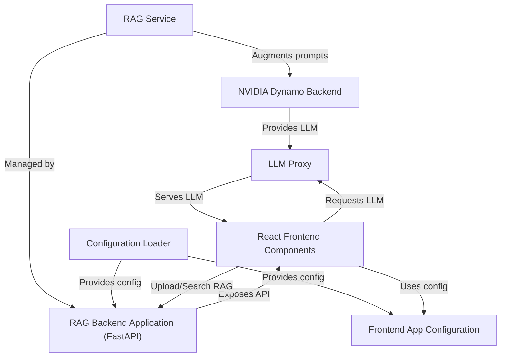

# Tutorial: Tutorial Chat Llama Nemotron

This project is a chat application powered by an **NVIDIA LLM (Large Language Model)**. It allows users to chat with an AI that can access and utilize a *knowledge base* to provide more informed responses. The application uses a **RAG (Retrieval-Augmented Generation) system** to enhance the LLM's knowledge.

**Source Repository:** [https://github.com/NVIDIA/GenerativeAIExamples/tree/main/community/chat-llama-nemotron](https://github.com/NVIDIA/GenerativeAIExamples/tree/main/community/chat-llama-nemotron)

## Chapters

1. [React Frontend Components
](01_react_frontend_components_.md)
2. [Frontend App Configuration
](02_frontend_app_configuration_.md)
3. [LLM Proxy
](03_llm_proxy_.md)
4. [RAG Service
](04_rag_service_.md)
5. [RAG Backend Application (FastAPI)
](05_rag_backend_application__fastapi__.md)
6. [NVIDIA Dynamo Backend
](06_nvidia_dynamo_backend_.md)
7. [Configuration Loader
](07_configuration_loader_.md)

---

Generated by [AI Codebase Knowledge Builder](https://github.com/The-Pocket/Tutorial-Codebase-Knowledge)